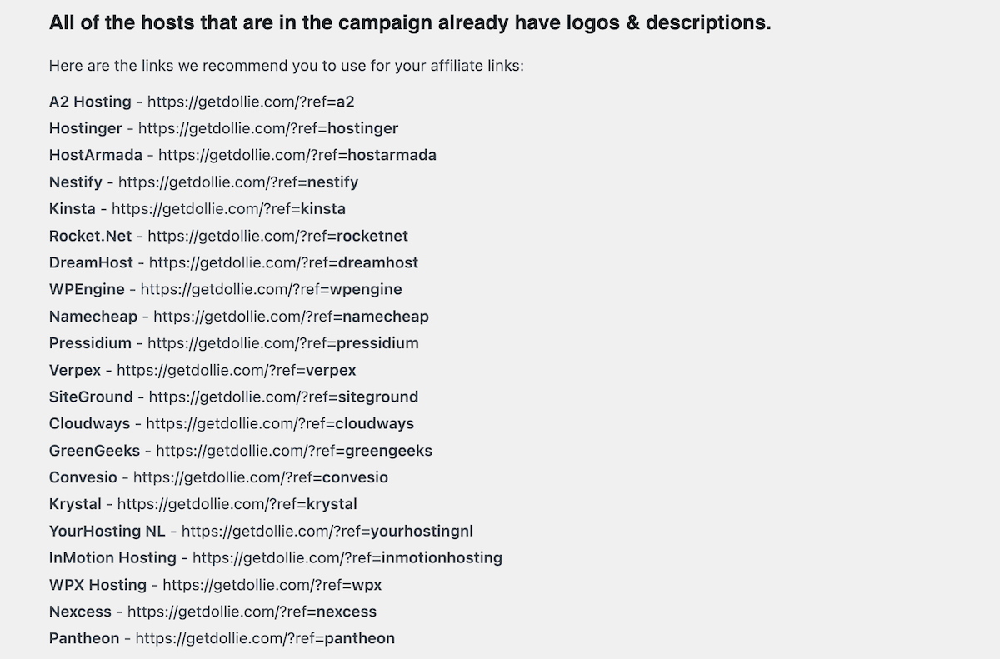

# Guildenberg Helper Plugin

## Description

The Guildenberg Helper Plugin assists in setting up Black Friday sales for Guildenberg, enabling the display of host information on landing pages using shortcodes.

## Installation

1. Download the plugin from this repo.
2. In your WordPress dashboard, go to `Plugins` > `Add New`.
3. Upload and activate the plugin.

## Usage

### Shortcodes

The plugin offers several shortcodes for displaying host information:

- `[gb-host-all]`: Displays all host information.
- `[gb-host-name]`: Shows the host name.
- `[gb-host-description]`: Shows the host description.
- `[gb-host-logo]`: Displays the GB host logo.
- `[gb-host-slug]`: Shows the host slug.

### Configuring the Plugin

Navigate to `Settings` > `Guildenberg Helper` in your WordPress admin to configure the plugin:

1. Enter the affiliate tracking URL parameter in the field provided. For example `?ref=`.
2. Click `Save Changes`.
3. On the settings page you will see a preview of the host information. If you see the default logo and text, you have not yet configured the plugin correctly.

### Overwriting the Configuration with your own affiliate links & logo.

You can overwrite the configuration file by placing a `hosts.php` file in your active theme's directory (`/your-theme/config/hosts.php`). The plugin will first check this directory for the config file before defaulting to the plugin directory.

**Copy the Config file to your active Theme Directory**:
   - Place a `hosts.php` file in your active theme's directory (`/your-theme/config/hosts.php`). You can copy the file from the plugin directory!
   - The plugin will first check this directory for the config file before defaulting to the plugin directory.
   - Update the default logo to use your own logo.

### What happens if someone visits my landing page without a affiliate tracking URL?

In this case it will fall back to the default logo and a default text.

### What happens if new hosts are added to Guildenberg?

When this happens we will let you know and you can update your config file with the new host information once you have added your affiliate links.

### Advanced Usage

Utilize `guildenberg_get_slug()` for conditional display in page builders or custom code. This function fetches the host's slug for advanced implementations.

## Support

For support or queries just reach out to me on the Guildenberg Slack!
